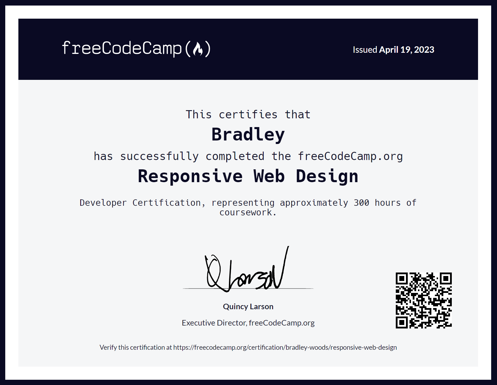

# freeCodeCamp Projects

This is a list of my projects I completed for the following [freeCodeCamp](https://www.freecodecamp.org/) courses:

## Responsive Web Design

1. [Survey Form](https://github.com/bradley-woods/freecodecamp-projects/tree/main/survey-form)

2. [Tribute Page](https://github.com/bradley-woods/freecodecamp-projects/tree/main/tribute-page)

3. [Technical Documentation Page](https://github.com/bradley-woods/freecodecamp-projects/tree/main/technical-documentation-page)

4. [Product Landing Page](https://github.com/bradley-woods/freecodecamp-projects/tree/main/product-landing-page)

5. [Personal Portfolio Webpage](https://github.com/bradley-woods/freecodecamp-projects/tree/main/personal-portfolio-webpage)
